  <h1>Hi there! 👋 I'm Jorge</h1>
  

  

---

### 👨‍💻 About Me
- 🔭 I'm a developer with some initial experience, but extremely eager to learn new technologies and build awesome things!
- 📫 Reach out to me: **jjvargasgalvez2006@gmail.com**

### 📬 Contact Me

  
  

---

### 💼 Experience

<table>
  <tr>
    <td align="center" width="200">
       
      <a href="https://www.kyndryl.com/es/es"><b>Tertius</b></a> 
      <i>May 2025 - June 2025</i>
    </td>
    <td>
      <b>Frontend Software Development</b> for a digital signature creation application.
    </td>
  </tr>
  <tr>
    <td align="center" width="200">
       
      <a href="https://www.kyndryl.com/es/es"><b>Kyndryl</b></a> 
      <i>Feb 2026 - Present</i>
    </td>
    <td>
      <b>Backend Software Developer & DevOps</b> within the Cloud Unit.
    </td>
  </tr>
</table>

---

### 🛠️ Skills & Technologies

#### 💻 Programming Languages & Markup

  
  
  
  
  
  
  
  
  
  

#### 🚀 Frameworks, Platforms & Databases

  
  
  
  
  
  
  
  
  
  
  

#### ⚙️ DevOps, Version Control & Containerization

  
  
  
  

#### 🛠️ Tools & IDEs

  
  
  
  
  

---

### 📊 GitHub Analytics

  

